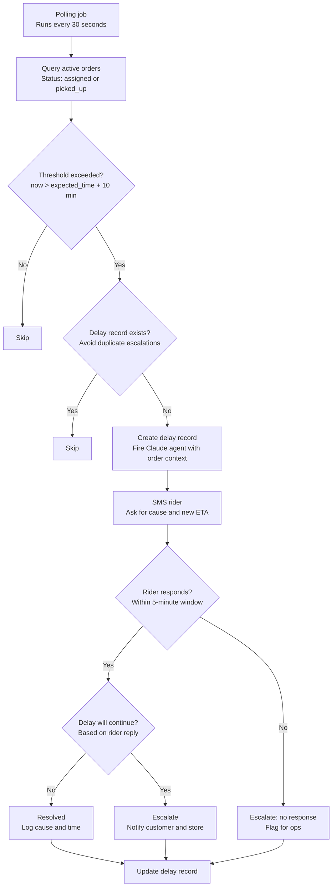

# Rider Delay Agent

An AI-powered operations tool that automatically detects delivery delays, contacts riders via SMS, interprets their responses, and escalates to customers and stores when needed — with minimal human intervention.

Built as a portfolio project to demonstrate agentic AI workflows, real-time ops tooling, and full-stack engineering across a Python backend and React frontend.

---

## Live demo

- **Ops dashboard:** https://frontend-peach-seven-32.vercel.app
- **API docs:** https://rider-delay-agent-production.up.railway.app/docs

---

## What it does

- **Detects delays automatically** — a polling job runs every 30 seconds, comparing current time against expected pickup and delivery times for all active orders
- **Contacts riders via SMS** — when a delay is detected, Claude generates a contextual message and sends it to the rider (via Twilio in production, mocked in dev)
- **Interprets rider responses** — when a rider replies, Claude reads the message, extracts the cause, and decides whether to escalate or wait
- **Escalates intelligently** — if the delay is severe or the rider is unresponsive, Claude notifies the customer and store with appropriate messages
- **Tracks everything** — a live ops dashboard shows all active delays, message threads, escalation status, and resolution metrics in real time
- **Customer tracking page** — a public-facing order status page shows customers their order timeline and any delay information

---

## Agent flow



---

## Demo flow

1. Click **New test order** on the dashboard
2. Select a rider, store, and customer — check "Already delayed"
3. Submit — the agent detects the delay within 30 seconds and sends an outbound message to the rider
4. Click **View** on the new delay row to open the detail card
5. Use **Simulate rider reply** to type a response (e.g. "stuck in traffic" or "got a flat tyre")
6. Watch Claude re-evaluate — it either updates the cause and waits, or escalates to the customer and store
7. Click **Track** on any delay row to see the customer-facing order tracking page

---

## Tech stack

| Layer | Technology |
|---|---|
| Backend | Python, FastAPI |
| AI agent | Anthropic Claude API (claude-opus-4-5) |
| Database | Supabase (PostgreSQL) |
| Scheduling | APScheduler |
| SMS | Twilio (mocked in dev, plug in credentials for prod) |
| Frontend | React, TypeScript, Vite |
| Styling | Tailwind CSS |
| Deployment | Railway (backend), Vercel (frontend) |

---

## Project structure

```
rider-delay-agent/
├── backend/
│   ├── app/
│   │   ├── main.py
│   │   ├── database.py
│   │   ├── routers/
│   │   │   ├── orders.py
│   │   │   ├── delays.py
│   │   │   ├── webhooks.py
│   │   │   └── lookup.py
│   │   ├── agent/
│   │   │   ├── claude_agent.py
│   │   │   ├── prompts.py
│   │   │   └── escalation.py
│   │   ├── scheduler/
│   │   │   └── poller.py
│   │   ├── services/
│   │   │   ├── sms.py
│   │   │   └── delay_detector.py
│   │   └── models/
│   │       └── schemas.py
│   └── requirements.txt
├── frontend/
│   └── src/
│       ├── pages/
│       │   ├── Dashboard.tsx
│       │   ├── OrderDetail.tsx
│       │   ├── OrderList.tsx
│       │   └── OrderTracking.tsx
│       ├── components/
│       │   ├── DelayTable.tsx
│       │   ├── DelayCard.tsx
│       │   ├── StatsBar.tsx
│       │   └── CreateOrderModal.tsx
│       └── api/
│           └── client.ts
├── schema.sql
├── seed.sql
└── README.md
```

---

## Data model

```
rider       --< order >-- customer
                 |            store
                 |
              delay --< message_log
```

- `order` has two delay scenarios: `late_pickup` (assigned, not yet collected) and `late_delivery` (picked up, not yet delivered)
- `delay` tracks the full lifecycle: detection, rider contact, response, escalation, resolution
- `message_log` stores every SMS in both directions with `recipient_type` (rider / customer / store)

---

## Local setup

### Prerequisites
- Python 3.11+
- Node.js 18+
- Supabase account
- Anthropic API key
- Twilio account (optional — SMS is mocked by default)

### Backend

```bash
cd backend
python -m venv venv
source venv/bin/activate
pip install -r requirements.txt
```

Create `backend/.env`:

```
SUPABASE_URL=your_supabase_url
SUPABASE_KEY=your_supabase_anon_key
ANTHROPIC_API_KEY=your_anthropic_key
TWILIO_ACCOUNT_SID=your_twilio_sid
TWILIO_AUTH_TOKEN=your_twilio_auth_token
TWILIO_PHONE_NUMBER=your_twilio_number
```

Run schema.sql then seed.sql in Supabase SQL Editor, then:

```bash
uvicorn app.main:app --reload --port 8000
```

API docs at http://127.0.0.1:8000/docs

### Frontend

```bash
cd frontend
npm install
npm run dev
```

App runs at http://localhost:5173

---

## Key engineering decisions

**Why APScheduler over Vercel Cron or pg_cron?**
APScheduler runs inside the FastAPI process — no additional infrastructure, easy to debug, and the polling logic stays in Python where the rest of the agent lives.

**Why mock SMS in dev?**
Twilio A2P 10DLC registration requirements make local SMS testing impractical. The mock logs the exact message that would be sent, which is sufficient for development and demos. Swap sms.py for the real Twilio implementation in production.

**Why Claude for rider communication?**
Rule-based systems send templated messages and cannot interpret free-text responses. Claude generates contextual outreach based on the specific order and rider, and interprets the reply to make a nuanced escalation decision — something a decision tree cannot do well.

**Why a separate customer tracking page?**
Ops and customer views have different information needs and trust levels. The tracking page exposes only customer-safe fields via a dedicated /orders/:id/tracking endpoint — no rider phone numbers, no internal IDs.

---

## API endpoints

| Method | Endpoint | Description |
|---|---|---|
| GET | /orders/ | All orders |
| GET | /orders/active | Active orders only |
| GET | /orders/:id | Single order |
| GET | /orders/:id/tracking | Customer-safe tracking payload |
| PATCH | /orders/:id/status | Update order status |
| POST | /orders/ | Create order |
| GET | /delays/ | All delays |
| GET | /delays/active | Active delays (pending + escalated) |
| GET | /delays/stats | Aggregate stats for dashboard |
| GET | /delays/:id | Single delay |
| GET | /delays/:id/messages | Message thread for a delay |
| GET | /delays/by-order/:id | All delays for an order |
| PATCH | /delays/:id/resolve | Manually resolve a delay |
| POST | /webhooks/sms | Twilio inbound SMS webhook |
| POST | /webhooks/sms/simulate | Simulate a rider reply (dev) |
| GET | /riders | Rider list |
| GET | /customers | Customer list |
| GET | /stores | Store list |
